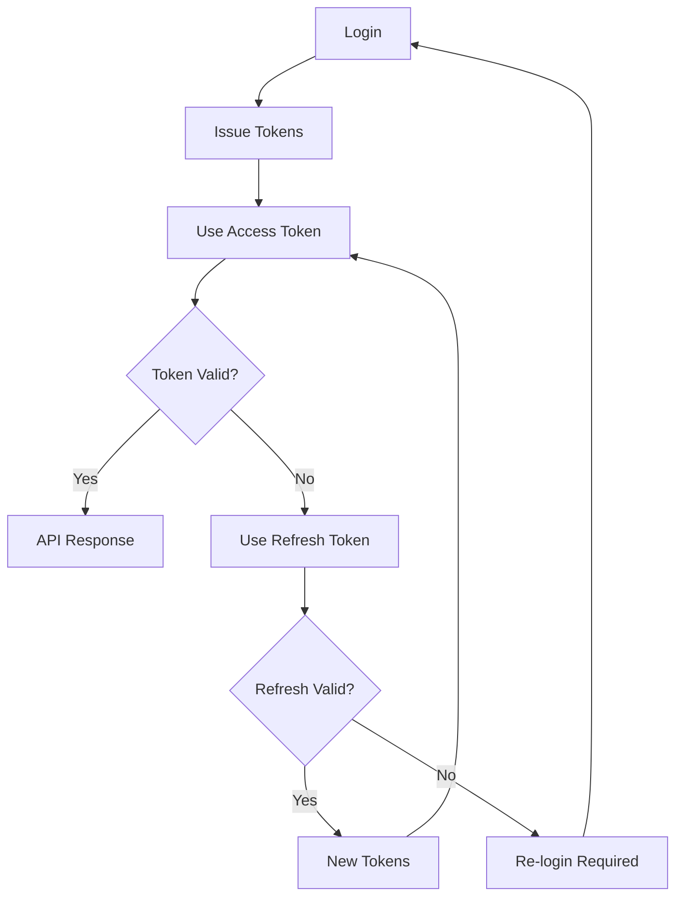

# Authentication Guide

This guide covers authentication concepts, implementation details, and best practices for the FullStack API.

## Table of Contents
1. [Authentication Overview](#authentication-overview)
2. [JWT Token System](#jwt-token-system)
3. [Authentication Flows](#authentication-flows)
4. [Security Features](#security-features)
5. [Implementation Examples](#implementation-examples)
6. [Best Practices](#best-practices)
7. [Troubleshooting](#troubleshooting)

## Authentication Overview

The FullStack API uses JWT (JSON Web Tokens) for stateless authentication, providing:
- **Secure token-based authentication**
- **Short-lived access tokens** (15 minutes)
- **Long-lived refresh tokens** (30 days)
- **Automatic token refresh** capability
- **Multi-device session support**

### Why JWT?

1. **Stateless**: No server-side session storage required
2. **Scalable**: Works across multiple servers/services
3. **Secure**: Cryptographically signed tokens
4. **Flexible**: Can include custom claims

## JWT Token System

### Token Types

#### Access Token
- **Purpose**: Authenticate API requests
- **Lifetime**: 15 minutes
- **Usage**: Include in Authorization header
- **Storage**: Memory or sessionStorage (browser)

#### Refresh Token
- **Purpose**: Obtain new access tokens
- **Lifetime**: 30 days
- **Usage**: Only for refresh endpoint
- **Storage**: Secure storage (httpOnly cookie recommended)

### Token Structure

```json
{
  "header": {
    "alg": "HS256",
    "typ": "JWT"
  },
  "payload": {
    "sub": "user-id",
    "username": "john_doe",
    "exp": 1234567890,
    "iat": 1234567890,
    "type": "access"
  },
  "signature": "..."
}
```

### Token Lifecycle



## Authentication Flows

### 1. Initial Login Flow

```typescript
// 1. User provides credentials
const credentials = {
  username: "john_doe",
  password: "SecurePassword123!"
};

// 2. Login request
const response = await fetch('/api/v1/auth/login', {
  method: 'POST',
  headers: { 'Content-Type': 'application/json' },
  body: JSON.stringify(credentials)
});

// 3. Receive tokens
const { access_token, refresh_token } = await response.json();

// 4. Store tokens securely
localStorage.setItem('access_token', access_token);
// Store refresh_token in httpOnly cookie for better security
```

### 2. Token Refresh Flow

```typescript
// Automatic refresh with SDK
const client = new FullStackClient(config);
// SDK handles refresh automatically

// Manual refresh
async function refreshAccessToken(refreshToken: string) {
  const response = await fetch('/api/v1/auth/refresh', {
    method: 'POST',
    headers: { 'Content-Type': 'application/json' },
    body: JSON.stringify({ refresh_token: refreshToken })
  });
  
  if (!response.ok) {
    throw new Error('Refresh failed');
  }
  
  return response.json();
}
```

### 3. Logout Flow

```typescript
// 1. Call logout endpoint (invalidates refresh token)
await fetch('/api/v1/auth/logout', {
  method: 'POST',
  headers: {
    'Authorization': `Bearer ${accessToken}`
  }
});

// 2. Clear local tokens
localStorage.removeItem('access_token');
// Clear refresh token cookie
```

### 4. Password Reset Flow

```typescript
// Step 1: Request reset
await fetch('/api/v1/auth/password-reset', {
  method: 'POST',
  headers: { 'Content-Type': 'application/json' },
  body: JSON.stringify({ email: 'user@example.com' })
});

// Step 2: User receives email with reset token

// Step 3: Confirm reset with token
await fetch('/api/v1/auth/password-reset/confirm', {
  method: 'POST',
  headers: { 'Content-Type': 'application/json' },
  body: JSON.stringify({
    token: 'reset-token-from-email',
    new_password: 'NewSecurePassword456!'
  })
});
```

## Security Features

### 1. Rate Limiting

Protect against brute force attacks:

| Endpoint | Limit | Window |
|----------|-------|--------|
| Login | 5 attempts | 15 minutes |
| Register | 5 attempts | 1 hour |
| Password Reset | 3 attempts | 1 hour |

### 2. Token Security

#### Access Token Security
- Short expiration (15 minutes)
- Never store in cookies (XSS vulnerable)
- Use Authorization header
- Validate on every request

#### Refresh Token Security
- Long expiration (30 days)
- Store in httpOnly cookie
- Rotate on use (optional)
- Revoke on logout

### 3. Password Requirements

```typescript
interface PasswordRequirements {
  minLength: 8;
  requireUppercase: true;
  requireLowercase: true;
  requireNumbers: true;
  requireSpecialChars: true;
}

function validatePassword(password: string): boolean {
  const regex = /^(?=.*[a-z])(?=.*[A-Z])(?=.*\d)(?=.*[@$!%*?&])[A-Za-z\d@$!%*?&]{8,}$/;
  return regex.test(password);
}
```

### 4. Account Security

- **Email verification** (optional)
- **Account lockout** after failed attempts
- **Password history** to prevent reuse
- **Two-factor authentication** (roadmap)

## Implementation Examples

### React Implementation

```typescript
// auth/AuthContext.tsx
import React, { createContext, useContext, useState, useEffect } from 'react';
import { FullStackClient, LocalStorageTokenStorage } from '@fullstack/api-client';

interface AuthContextType {
  client: FullStackClient;
  user: User | null;
  login: (username: string, password: string) => Promise<void>;
  logout: () => Promise<void>;
  isAuthenticated: boolean;
}

const AuthContext = createContext<AuthContextType | null>(null);

export function AuthProvider({ children }: { children: React.ReactNode }) {
  const [user, setUser] = useState<User | null>(null);
  const [client] = useState(() => new FullStackClient({
    baseURL: process.env.REACT_APP_API_URL!
  }, new LocalStorageTokenStorage()));

  useEffect(() => {
    // Check if user is already logged in
    if (client.isAuthenticated()) {
      client.getCurrentUser()
        .then(setUser)
        .catch(() => client.clearTokens());
    }
  }, [client]);

  const login = async (username: string, password: string) => {
    await client.login({ username, password });
    const user = await client.getCurrentUser();
    setUser(user);
  };

  const logout = async () => {
    await client.logout();
    setUser(null);
  };

  return (
    <AuthContext.Provider value={{
      client,
      user,
      login,
      logout,
      isAuthenticated: !!user
    }}>
      {children}
    </AuthContext.Provider>
  );
}

export const useAuth = () => {
  const context = useContext(AuthContext);
  if (!context) {
    throw new Error('useAuth must be used within AuthProvider');
  }
  return context;
};
```

### Vue.js Implementation

```typescript
// stores/auth.ts
import { defineStore } from 'pinia';
import { FullStackClient } from '@fullstack/api-client';

export const useAuthStore = defineStore('auth', {
  state: () => ({
    user: null as User | null,
    client: new FullStackClient({
      baseURL: import.meta.env.VITE_API_URL
    })
  }),

  getters: {
    isAuthenticated: (state) => !!state.user
  },

  actions: {
    async login(username: string, password: string) {
      await this.client.login({ username, password });
      this.user = await this.client.getCurrentUser();
    },

    async logout() {
      await this.client.logout();
      this.user = null;
    },

    async checkAuth() {
      if (this.client.isAuthenticated()) {
        try {
          this.user = await this.client.getCurrentUser();
        } catch {
          this.client.clearTokens();
        }
      }
    }
  }
});
```

### Next.js Implementation

```typescript
// lib/auth.ts
import { FullStackClient } from '@fullstack/api-client';
import { cookies } from 'next/headers';

export async function getServerSideClient() {
  const cookieStore = cookies();
  const accessToken = cookieStore.get('access_token')?.value;
  const refreshToken = cookieStore.get('refresh_token')?.value;

  const client = new FullStackClient({
    baseURL: process.env.API_URL!
  });

  if (accessToken && refreshToken) {
    client.setTokens({
      access_token: accessToken,
      refresh_token: refreshToken,
      token_type: 'bearer'
    });
  }

  return client;
}

// app/api/auth/login/route.ts
export async function POST(request: Request) {
  const { username, password } = await request.json();
  
  const client = new FullStackClient({
    baseURL: process.env.API_URL!
  });

  try {
    const tokens = await client.login({ username, password });
    
    // Set secure cookies
    cookies().set('access_token', tokens.access_token, {
      httpOnly: true,
      secure: true,
      sameSite: 'lax',
      maxAge: 15 * 60 // 15 minutes
    });
    
    cookies().set('refresh_token', tokens.refresh_token, {
      httpOnly: true,
      secure: true,
      sameSite: 'lax',
      maxAge: 30 * 24 * 60 * 60 // 30 days
    });

    return Response.json({ success: true });
  } catch (error) {
    return Response.json({ error: 'Login failed' }, { status: 401 });
  }
}
```

## Best Practices

### 1. Token Storage

#### Browser Applications
```typescript
// Good: SessionStorage for high security
sessionStorage.setItem('access_token', token);

// Good: LocalStorage for persistence
localStorage.setItem('access_token', token);

// Better: Secure HTTP-only cookies for refresh tokens
document.cookie = `refresh_token=${token}; Secure; HttpOnly; SameSite=Strict`;

// Bad: Regular cookies (XSS vulnerable)
document.cookie = `access_token=${token}`;
```

#### Mobile Applications
```typescript
// React Native
import * as SecureStore from 'expo-secure-store';

await SecureStore.setItemAsync('access_token', token);

// Flutter
import 'package:flutter_secure_storage/flutter_secure_storage.dart';

final storage = FlutterSecureStorage();
await storage.write(key: 'access_token', value: token);
```

### 2. Request Interceptors

```typescript
// Axios interceptor example
axios.interceptors.request.use(
  config => {
    const token = localStorage.getItem('access_token');
    if (token) {
      config.headers.Authorization = `Bearer ${token}`;
    }
    return config;
  },
  error => Promise.reject(error)
);

// Handle 401 responses
axios.interceptors.response.use(
  response => response,
  async error => {
    if (error.response?.status === 401 && !error.config._retry) {
      error.config._retry = true;
      
      try {
        const tokens = await refreshAccessToken();
        localStorage.setItem('access_token', tokens.access_token);
        error.config.headers.Authorization = `Bearer ${tokens.access_token}`;
        return axios(error.config);
      } catch {
        // Redirect to login
        window.location.href = '/login';
      }
    }
    return Promise.reject(error);
  }
);
```

### 3. Security Headers

Always include security headers in production:

```typescript
// Express middleware
app.use((req, res, next) => {
  res.setHeader('X-Content-Type-Options', 'nosniff');
  res.setHeader('X-Frame-Options', 'DENY');
  res.setHeader('X-XSS-Protection', '1; mode=block');
  res.setHeader('Strict-Transport-Security', 'max-age=31536000; includeSubDomains');
  next();
});
```

### 4. CORS Configuration

Configure CORS properly:

```typescript
// Strict CORS for production
const corsOptions = {
  origin: ['https://app.example.com'],
  credentials: true,
  methods: ['GET', 'POST', 'PUT', 'DELETE'],
  allowedHeaders: ['Content-Type', 'Authorization']
};
```

## Troubleshooting

### Common Issues

#### 1. 401 Unauthorized
```typescript
// Check token expiration
function isTokenExpired(token: string): boolean {
  try {
    const payload = JSON.parse(atob(token.split('.')[1]));
    return Date.now() >= payload.exp * 1000;
  } catch {
    return true;
  }
}

// Debug token issues
console.log('Token expired?', isTokenExpired(accessToken));
console.log('Token present?', !!accessToken);
console.log('Auth header format:', `Bearer ${accessToken}`);
```

#### 2. CORS Errors
```typescript
// Verify CORS configuration
fetch('https://api.example.com/health', {
  credentials: 'include', // Important for cookies
  headers: {
    'Content-Type': 'application/json'
  }
});
```

#### 3. Token Refresh Loop
```typescript
// Prevent infinite refresh loops
let isRefreshing = false;
let refreshSubscribers: Array<(token: string) => void> = [];

function onRefreshed(token: string) {
  refreshSubscribers.forEach(callback => callback(token));
  refreshSubscribers = [];
}

function addRefreshSubscriber(callback: (token: string) => void) {
  refreshSubscribers.push(callback);
}

// In interceptor
if (error.response?.status === 401) {
  if (!isRefreshing) {
    isRefreshing = true;
    
    refreshAccessToken()
      .then(tokens => {
        isRefreshing = false;
        onRefreshed(tokens.access_token);
      })
      .catch(() => {
        isRefreshing = false;
        // Redirect to login
      });
  }
  
  return new Promise(resolve => {
    addRefreshSubscriber((token: string) => {
      error.config.headers.Authorization = `Bearer ${token}`;
      resolve(axios(error.config));
    });
  });
}
```

### Debug Checklist

- [ ] Token is included in Authorization header
- [ ] Token format is correct: `Bearer <token>`
- [ ] Token is not expired
- [ ] CORS is properly configured
- [ ] API endpoint URL is correct
- [ ] Network connection is stable
- [ ] Rate limits are not exceeded

## Additional Resources

- [JWT.io](https://jwt.io/) - JWT debugger
- [OWASP Authentication Cheat Sheet](https://cheatsheetseries.owasp.org/cheatsheets/Authentication_Cheat_Sheet.html)
- [RFC 7519 - JSON Web Token](https://tools.ietf.org/html/rfc7519)